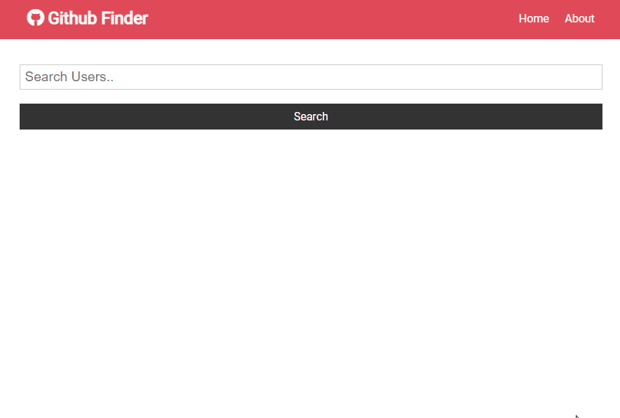

## About The Project

This is a quick tutorial project to solidfy knowledge of Basic React Concepts:
- Class vs. Functional Components
- React Router
- Hooks
- Context API

### Built With

This project was built using:

- [React](https://reactjs.org/)
- [Node.js](https://nodejs.org/api/fs.html)
